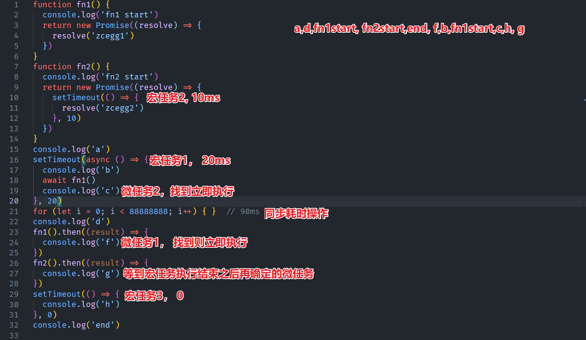

## 一、名词说明
> JS 当中是否存在异步编程
> JS 是否能同时处理多件事情（JS是多线程的）
> 事件循环是为了解决什么问题或者达到了什么效果
> 事件循环中的循环如何体现

### 1.1 进程线程
1. 进程可以看做是一个应用程序（例如打开浏览器或者浏览器打开一个页面）
2. 线程是程序当中具体做事情的人， 每个线程同一时刻只能做一件事
3. 一个进程当中可以包含多个线程 

### 1.2 同步异步
- 同步编程：一件事一件事的去做，上一件事情没有做完，下一件事情不会被处理（单线程）
- 异步编程：上一件事情没有处理完，但是下一件事情可以继续去处理（多线程）
- 基于单线程的 EventLoop 机制也可以实现异步编程 

### 1.3 JS中的异步编程
1. promise（then)
2. async/await （generator)
3. requestAnimationFrame
4. 定时器操作
5. ajax(Http网络请求)
6. 事件绑定

### 1.4 JS 单线程
> 浏览器平台下的 JS 代码是由 JS 引擎执行的，所以它是单线程
> 浏览器是多线程：GUI渲染进程、JS 引擎线程、事件触发线程、定时器触发线程、异步http请求线程
1. JS 中大部分代码都是同步编程
2. JS可以基于单线程的 EventLoop(事件循环机制) 实现出异步效果

## 二、EventLoop 模型
[事件循环模型图](https://www.processon.com/diagraming/60e6ac6ae0b34d548fc2bc75)

### 2.1 代码执行顺序
1. 浏览器加载界面之后会开启一个线程来执行 JS，称之叫 JS引擎（主线程） 
2. JS引擎会自上而下的执行 JS 代码，此过程会遇到（定时器，网络请求，事件绑定，promise....)
3. 遇到上述代码执行之后，浏览器会开启一个 Event Queue(任务|事件)队列 **优先级队列结构**
4. 在队列当中存在二个任务队列：微任务 microtask | 宏任务 macrotask 
5. 最终会将遇到的异步任务存放到 Event Queue 队列当中（未执行）
6. 主线程会继续向下执行同步代码，直到所有同步执行完就会处理异步任务
7. 进入 Event Queue 当中查找异步任务，找到之后放入主线程中执行（此时主线程又被占用）
8. 执行完一个异步任务之后，主线程再次空闲，此时再进入 Event Queue 查找余下的异步任务

### 2.2 异步任务执行顺序 
1. 先执行微任务（只要有微任务就不会处理宏任务）
2. 微任务（一般是谁先放置谁先执行）
3. 宏任务（一般是谁先到达的谁先执行）

### 2.3 整体顺序
1. 同步任务
2. 异步微任务
3. 异步宏任务
> - 如果同步任务执行过程中遇到可执行的异步任务，此时依然需要等到同步任务执行完
> - 如果同步任务执行完，还没有可执行的异步任务，此时也只能等待 
> - 不论何时放入的微任务，只要异步微任务存在，就永远不会执行异步宏任务

### 2.4 setTimeout补充
1. 设置定时器这个操作是同步的
2. 放置在 Event Queue 中的任务是异步宏任务
3. 函数调用返回数字，表示当前是第几个定时器
4. 等待时间设置为 0 时，也不是立即执行，浏览器存在最快的反应时间
5. 定时器的等待时间到了之后，它的代码可能还不会执行（处于异步队列中，同步任务还未完成执行）

## 三、执行练习
### 3.1 理解执行顺序题
```js
setTimeout(() => {
  console.log('1')
}, 30)

console.log(2)

setTimeout(() => {
  console.log(3)
}, 20)

console.log(4)


console.time('AA')
// 消耗95ms
for (let i = 0; i < 88888888; i++) { }
console.timeEnd('AA')

console.log(5)

setTimeout(() => {
  console.log(6)
}, 18)

console.log(7)

setTimeout(() => {
  console.log(8)
}, 25)

console.log(9)
```
### 3.2 主线程占用
```js
// 死循环是将主线程彻底占用，其它所有事情不在处理
// 跑出异常只会影响下面的同步任务，已经放置在队列当中的任务会继续执行
setTimeout(() => {
  console.log(1)
}, 0)

console.log(2)
while (true) { }
// throw new Error('手动抛出异常')
// console.log(a)

console.log(3)

setTimeout(() => {
  console.log(4)
}, 10)

console.log(5)
```

## 四、Promise
> ES6 当中新增的一个类，Promise 是一种承诺、约定的模式，基于这种模式可以有效的处理异步编程 
> 做为一种优秀的代码管理模式，可以有效的管理异步编程当中的代码，让代码开发起来更便捷，维护起来更方便，可读性更强

### 4.1 Promise 语法 
1. 执行 new 操作时必须传入函数做为参数（executor 函数）
   1. executor 函数接收两个函数做为参数，且会立即执行
   2. executor 函数一般用于管控异步操作（书写异步代码）
2. new 操作执行之后会返回一个 Promise 实例
   1. [[PromiseState]] promise 状态： pending（准备状态） fulfilled(成功态) rejected(已拒绝)
   2. [[PromiseResult]] promise值：默认的是 undefined， 一般用于存储成功的结果或者失败的原因
   3. __proto__：查找 Promise.prototype 原型，存在 then catch finally 三个常见的方法  
3. 改变状态
   1. 执行 resolve 控制实例的状态改变为成功态，传递的值是成功的结果 
   2. 执行 reject 控制实例的状态改变为 rejected, 传递的值就是失败的结果
   3. 如果 executor 函数中的代码执行报错，则状态也会切换至失败态，报错原因是 value 值 
   4. 一旦状态从 pending 切到了 fulfilled 或者 rejected ，都无法再次改变其状态 
4. 异步处理
   1. new Promise 之后立即执行 executor 函数 
   2. 在 executor 函数中管理了一个异步编程代码，此时状态是 pending
   3. 当异步操作到达指定的时间，开始执行时（看做是异步操作成功）通过调用 resolve修改 promise 状态为 fulfilled 
   4. 状态明确之后就可以执行后续的代码， 成功态调用第一个方法，失败态调用第二个方法 
  ```js
  let p1 = new Promise((resolve, reject)=>{
    setTimeout(()=>{
      resolve('ok')
    }, 1000)
  })
  ```
5. 执行顺序
   1. 执行 new Promise 
   2. 执行 executor 函数：设置定时器，不等待
   3. 执行 p1.then 注入两个方法（被注入的方法会被保存起来）
   4. 同步代码完成，等待异步到达执行时机 
   5. 执行定时器回调：调用 resolve 或 reject 修改promise的状态和值 
   6. 通知之前基于 then 注入的两个方法中的第一个执行  
```js
let p1 = new Promise((resolve, reject) => {
  console.log(1)
  // 修改状态和值，这是同步操作，通知基于 then 注入的方法执行
  // 但代码执行到此时，方法还未注册，因此不知道通知谁来执行
  // 此时需要把“通知方法执行的操作保存起来”，这是一个异步操作
  resolve('ok')  //! 异步操作
  console.log('2')
})
// 注入方法是同步的
p1.then((ret) => {
  console.log('成功态--->', ret)
}, (reason) => {
  console.log('失败态--->', reason)
})
console.log(3)
```
### 4.2 Promise状态和值分析
1. new Promise 获取实例
   1. 通过调用 resolve 或 reject 控制[[PromiseState]] 和 [[PromiseResult]]
   2. executor 函数执行失败 ， 状态为 rejected ，值为报错信息
2. 执行 then 返回实例
   1. then 注入的两个方法不论哪一个执行，只要执行不报错，新实例的状态就是 fulfilled，反之就是 rejected, 新实例的值就是方法的返回值
   2. 如果方法执行返回新的 Promise 实例，则此实例最后的成功或者失败就决定了 then 拿到的实例是成功还是失败，值都是一样的
```js
let p1 = new Promise((resolve, reject) => {
  resolve('ok')
})

let p2 = p1.then((result) => {
  console.log('成功-->', result)
  return 10
}, (reason) => {
  console.log('失败-->', reason)
  return 20
})

p2.then((result) => {
  console.log('成功-->', result)
}, (reason) => {
  console.log('失败-->', reason)
})
```
### 4.3 失败Promise 处理
1. 对于失败的 promise 实例如果没有编写方法处理其结果，则会在控制台中抛出异常信息（但不阻碍其它代码执行）
2. then 链中的方法处理存在顺延机制,如果某个方法没有传递，则会顺延至下一个then中具备相同状态需要执行的函数
```js
// 此时浏览器会抛出语法异常
Promise.reject('NO').then((result) => {
  console.log('只添加了成功态')
})

// 顺延机制
Promise.reject('No').then((result) => {
  console.log('成功的方法')
}).then(null, (reason) => {
  console.log('第二个then当中的reject 处理方法', reason)
})

// catch 使用
Promise.resolve('拉勾教育').then((result) => {
  console.log('成功1-->', result)
  return 10
}).then((result) => {
  console.log('成功2-->', result)
  return Promise.reject('用 catch 最后来处理失败')
}).catch(reason => {
  console.log('失败原因是：', reason)
})
```
### 4.4 处理多个 promise 
1. promise.all 等待所有的 promise 实例都成功，整体返回的状态才成功，只要有一个失败，整体失败 
2. promise.race 看多个实例谁先处理完，先处理完成的状态，不论失败还是成功，就是最后整体的状态  
### 4.5 promise与微任务
1. .then 操作
   1. 当前实例的状态如果是明确的，则会创建一个异步微任务
   2. 当前实例的状态如果是 pending ，则只是将任务进行保存，并没有创建微任务
2. resolve|reject 执行
   1. 此时会创建一个异步微任务，同步结束后基于状态执行 then 的相关操作 

## 五、async 与 await
### 5.1 async 特点
1. 用于修饰函数，默认让函数返回一个 promise 实例
2. 如果函数执行报错，则promise 状态为 rejected ，值为报错原因
3. 如果函数执行正常则实例状态为 fulfilled，值为函数返回，如果函数没有返回值则值为 undefined 
```js
async function foo() {
  return 10
}

console.log(foo())

foo().then((result) => {
  console.log('成功态-->', result)
})
```
### 5.2 await 
1. await 要基于 async 配合使用，一般不会单独使用 async 
2. await 后面一般放置的是 promise 实例，如果不是，则会将它转为 new Promise.resolve()处理
3. await foo() 执行规则是立即执行 foo 函数，接收 foo 的返回值然后处理为 promise 实例
4. await 本身是一个异步微任务：把当前上下文中 await 下面要执行的代码整体存储到异步的微任务当中， 当await 后面的 promise 实例状态为成功之后，再去执行下面的代码（也就是那个异步微任务）
```js

function foo() {
  console.log(1)
  return new Promise(resolve => {
    setTimeout(() => {
      resolve(2)
    }, 1000)
  })
}

console.log(3)

async function fn() {
  console.log(4)
  let result = await foo()
  console.log(result)
  console.log(5)
}

fn()

console.log(6)

```

## 六、面试题
```js
async function async1() {
  console.log('async1 执行了')
  await async2()
  console.log('async1 结束了')
}

async function async2() {
  console.log('async2')
}

console.log('同步代码执行了')

setTimeout(() => {
  console.log('setTimeout')
}, 0)

async1()

new Promise((resolve) => {
  console.log('promise1')
  resolve()
}).then(() => {
  console.log('promise2')
})

console.log('同步代码结束了')
```

```js
const button = document.getElementById('btn')
button.addEventListener('click', () => {
  Promise.resolve().then(() => {
    console.log('a')
  })
  console.log('b')
})

button.addEventListener('click', () => {
  Promise.resolve().then(() => {
    console.log('c')
  })
  console.log('d')
})

```

```js
console.log('start')
let timer
Promise.resolve()
  .then(() => {
    console.log('a')
  })
  .then(() => {
    console.log('b')
  })
 
setTimeout(() => {
  Promise.resolve()
    .then(() => {
      console.log('c')
    })
    .then(() => {
      console.log('d')
    })
  timer = setInterval(() => {
    console.log('loop')
  }, 4000)
  console.log('setTimeout')
}, 0)
```

```js
setTimeout(function foo1() {
  console.log('1')
})

Promise.resolve().then(function foo2() {
  console.log('2')
}).then(function foo3() {
  return Promise.resolve('3').then(function foo4(data) {
    setTimeout(function foo5() {
      console.log('4')
    })
    console.log('5')
    return data
  })
}).then(function foo6(ret) {
  console.log(ret)
})
```

```js
function fn1() {
  console.log('fn1 start')
  return new Promise((resolve) => {
    resolve('zcegg1')
  })
}
function fn2() {
  console.log('fn2 start')
  return new Promise((resolve) => {
    setTimeout(() => {
      resolve('zcegg2')
    }, 10)
  })
}
console.log('a')
setTimeout(async () => {
  console.log('b')
  await fn1()
  console.log('c')
}, 20)
for (let i = 0; i < 88888888; i++) { }  // 90ms  
console.log('d')
fn1().then((result) => {
  console.log('f')
})
fn2().then((result) => {
  console.log('g')
})
setTimeout(() => {
  console.log('h')
}, 0)
console.log('end')
```


## 七、面向对象

### 2.1 普通函数与构造函数 

> 函数还是之前的函数，唯一的区别就是首字母大写
> [执行图](https://www.processon.com/diagraming/60e6b5eb7d9c085ce81a07f9)

```js
function Foo(m, n) {
  let ret = m + n
  this.m = m
  this.n = n
  return ret
}

// 01 普通函数调用
let ret = Foo(10, 20)
console.log(ret)

// 02 构造函数执行
let res = new Foo(20, 20)
console.log(res)
```

#### 2.1.1 普通函数

- 正常调用，不需要 new 关键字
- 执行过程还是按着堆栈执行 + 作用域链查找机制

#### 2.1.2 构造函数

- 使用 new 关键字调用 
- 与普通函数类似，同样会创建私有上下文，然后进栈执行
- 执行 new 操作时，浏览器会创建一个空间表示空对象与 this 进行关联
- 函数体内如果没有 return 或者说 return 的是基本数据类型，默认返回对象实例
- 函数体内如果返回引用类型，那么就以自己返回为主
- 函数此时叫做类，返回的结果叫对象实例

#### 2.1.3 new 操作符

- 正常情况下使用 new 完成对象实例创建，如果当前类不需要传递参数，则可以不加括号运行
- new Foo,未加小括号说明 FOO 不需要传参，称之为无参列表 
- new Foo 与 new Foo() 的优先级不同，前者为 19， 后者为 20 
- 每一次 new 都会将函数重新执行，生成一个新的执行上下文，创建一个新的实例对象，因此两个实例对象不一样

### 2.2 原型及原型链

[原型及原型链](https://www.processon.com/diagraming/60e6bb260e3e741a944c9f7a)

#### 2.2.1 名词说明

- prototype 属性
  - 每一个函数（除箭头函数）数据类型，都自带一个 prototype 属性，指向原型对象（Function除外）
  - 每个原型对象自带一个 constructor 属性，指向当前构造函数本身
  - 函数数据类型
    - 普通函数、箭头函数、生成器函数
    - 构造函数（自定义类）
    - 内置函数（内置构造函数）
- __proto__ 属性
  - 每一个对象数据类型，都自带一个 __proto__ 属性，（隐式原型）
  - 该属性的值指向所属类的原型对象 prototype  
  - 对象数据类型
    - 普通对象、数组对象、正则对象、日期对象
    - prototype 原型对象 
    - 实例对象
    - 函数也是对象 
- Object 类
  - 所有对象都是 Object 内置类的实例
  - Object也是一个函数，同样具有 prototype 属性，指向自己的原型对象
  - 它的原型也是一个对象，因此具有 __proto__ 属性
  - Object 原型对象的__proto__ 指向 Null( 内部设计 )

#### 2.2.2 原型链查找机制

1. 首先找自己私有的属性， 私有中存在就是私有的
2. 私有中不存在，则默认基于 __proto__ 找所属类的原型对象
3. 如果类的原型上没有，则基于原型对象的 __proto__ 继续向上查找，直到找到 Object.prototype 为止

#### 2.2.3 示例代码

[原型及原型链查找图](https://www.processon.com/diagraming/60d96ab97d9c087f5477c624)

```js
function Foo() {
  this.m = 10
  this.n = 24
  this.getM = function () {
    console.log(this.m)
  }
}
Foo.prototype.getM = function () {
  console.log(this.m)
}

Foo.prototype.getN = function () {
  console.log(this.n)
}

let foo1 = new Foo
let foo2 = new Foo
console.log(foo1.getM === foo2.getM)  
console.log(foo1.getN === foo2.getN)
console.log(foo1.__proto__.getN === Foo.prototype.getN)  
console.log(foo1.__proto__.getM === foo2.getM) 
console.log(foo1.getM === Foo.prototype.getM) 
console.log(foo1.constructor) 
console.log(Foo.prototype.__proto__.constructor) 
foo1.getM()  
foo1.__proto__.getM() 
foo2.getN()  
Foo.prototype.getN() 
```

### 2.3 重写 new 方法

#### 2.3.1 new 做了什么

1. 创建实例对象
2. 执行构造函数，将this指向实例对象
3. 处理返回值

#### 2.3.2 模拟new实现

```js
function Person(name) {
  this.name = name
}
Person.prototype.slogan = function () {
  console.log('前端界最帅的人')
}
Person.prototype.sayName = function () {
  console.log(`我的名字是${this.name}`)
}

// let p1 = new Person('zce')
// p1.slogan()
// p1.sayName()

function _new(Ctor, ...params) {
  //01 创建实例对象
  // let obj = {}
  // obj.__proto__ = Ctor.prototype
  let obj = Object.create(Ctor.prototype)

  //02 调用构造函数，改变this指向
  let ret = Ctor.call(obj, ...params)

  //03 处理返回结果
  if (ret !== null && /^(object|function)$/.test(typeof ret)) return ret
  return obj
}

let p1 = _new(Person, 'zce')
p1.slogan()
p1.sayName()
console.log(p1 instanceof Person)
```

### 2.4 Function 与 Object 

[Function与 Object](https://www.processon.com/diagraming/60e6c57b0e3e741a944cd0b2)

#### 2.4.1 函数多种角色

1. 函数
   1. 普通函数调用（堆栈执行作用域）
   2. 构造函数实例化（原型及原型链）
2. 对象
   1. 键值对
3. 三种角色之间没有必然的联系，但是最核心的函数就是函数

#### 2.4.2 语录

1. Function是一等公民，在 JS中存在多种角色，普通函数、构造函数、对象
2. 每一个对象都存在 __proto__ 属性，指向所属类的原型对象（隐式原型，原型链属性）
3. 每一个函数都存在 prototype 属性，指向它的原型对象
4. 所有函数都是 Function 内置类的实例，且Function 本身也是一个函数 
5. 所有对象都是 Object 的实例，且 Object 本身也是一个函数 
6. Function 与 Object 是二大并行的基类，虽然最终查找落脚点都是 Object 身上
7. Function.prototype 原型对象是一个匿名函数，虽然它是一个函数，但是它的处理机制和原型对象是一样的， 它的 __proto__ 属性指向所属类的原型对象，也就是 Object.prototype 

#### 2.4.3 不具备prototype 属性

1. Function.prototype 不具备，是一个匿名函数
2. 对象中使用ES6语法定义函数 `const obj = { say(){} }`
3. 箭头函数 
4. 不具备prototype属性的函数是不能执行 new 操作的

### 2.5 This规律

> 在浏览器平台下运行 JS ，非函数当中的this 一般都指向 window。
> 因此这里讨论的是函数执行过程中的 this
> 需要注意在 ES6+ 的箭头函数中是没有自己this的，处理机制是使用自己上下文里的 this

#### 2.5.1 This是什么

1. this 就是当前函数执行的主体（谁执行了函数），不等于执行上下文，当前作用域
2. zce 在拉勾教育讲前端
   1. 讲前端是一个动作（函数）
   2. 拉勾教育（执行上下文）
   3. zce 主体， 本次函数在当前执行上下文执行的 this 指向

#### 2.5.2 常见this场景

1. 事件绑定 
2. 普通函数
3. 构造函数
4. 箭头函数
5. 基于 call/bind/apply 强制改变 this 指向

#### 2.5.3 规律

1. 事件绑定
   1. 不论是DOM2还是 DOM0 事件绑定，事件触发时this一般都是被操作的元素
2. 普通函数
   1. 函数执行时查看前面是否有点，如果有点，则点前面的就是执行主体，没有点就是 window，严格模式下是 undefined 
   2. 特殊情况
      1. 匿名函数中的 this 是  window 或者 undefined 
      2. 回调函数中的 this 一般也是window或者 undefined 
      3. 小括号语法
         1. 如果小括号只有一项，则相当于没加
         2. 如果小括号当中有多项，则取出最后一项，此时相当于拷贝函数，所以调用时主体是 window

#### 2.5.3 this 练习

[this练习](https://www.processon.com/diagraming/60e6c90ef346fb3713c8bd19)

```js
(function () {
  console.log(this)
})()

let arr = [1, 3, 5, 7]
obj = {
  name: '拉勾教育'
}
arr.map(function (item, index) {
  console.log(this)
}, obj)
------------------------------------------------------
//? 普通函数调用
let obj = {
  fn: function () {
    console.log(this, 111)
  }
}
let fn = obj.fn;
fn()  // window
obj.fn();  // obj
(10, fn, obj.fn)();
------------------------------------------------------
var a = 3, 
  obj = { a: 5 }
obj.fn = (function () { 
  this.a *= ++a
  return function (b) {
    this.a *= (++a) + b
    console.log(a)
  }
})();
var fn = obj.fn  
obj.fn(6)
fn(4)
console.log(obj.a, a)
```

